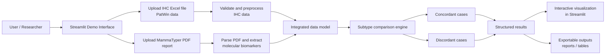

<p align="center">
  
</p>

<h1 align="center">MammaScope</h1>

<p align="center">
Breast Cancer Concordance Analysis Tool
</p>

<p align="center">
  
  
  
  
</p>


**MammaScope** is a Streamlit-based software tool designed to integrate and compare immunohistochemistry (IHC) results with MammaTyper molecular profiling in breast cancer.


## Project Context

This repository contains the **public demonstration version** of MammaScope, developed as part of a Bachelor's Thesis in Health Engineering at the University of Burgos.

The demo version allows users to test the complete workflow of the application using simulated data, while the full version is designed to operate in a controlled clinical environment.


---
## Scientific Background

Breast cancer classification in clinical practice is commonly performed using immunohistochemistry (IHC), evaluating ER, PR, HER2 and Ki-67 biomarkers.

Gene expression–based assays such as **MammaTyper®** provide quantitative measurements of ESR1, PGR, ERBB2 and MKI67, enabling more reproducible molecular subtyping.

MammaScope was developed to facilitate automated comparison between these diagnostic approaches and support concordance analysis between molecular and immunohistochemical classification.

---

## System Workflow

The application integrates heterogeneous clinical data sources and processes them through a structured analysis pipeline.

The following diagram summarizes the main processing pipeline of the demo application, from file upload to result generation.



---

## Live Demo

Try the application online:

[Open the live demo](https://mammascope-demo.streamlit.app/)

The demo includes **simulated and anonymized example files** so the full workflow can be tested without using real clinical data.

---

## Overview

Breast cancer molecular subtyping is essential for guiding therapeutic decisions. In routine clinical practice, classification is commonly performed using **immunohistochemistry (IHC)** by evaluating biomarkers such as:

- ER (Estrogen Receptor)
- PR (Progesterone Receptor)
- HER2
- Ki-67

However, IHC presents limitations related to **inter-observer variability and subjective interpretation**, particularly for Ki-67.

The **MammaTyper® assay**, based on RT-qPCR technology, quantifies the expression of the genes:

- ESR1
- PGR
- ERBB2
- MKI67

This provides a **quantitative and reproducible molecular classification**.

This project develops a software tool that **automates the integration and comparison of results between both methods**, facilitating the analysis of diagnostic concordance.

---

## Key Features

The system provides the following functionality:

- Import of **IHC results from Excel files (PatWin)**
- Import of **MammaTyper PDF reports**
- Automatic **biomarker extraction**
- Integration of results into a structured dataset
- Identification of **concordances and discordances**
- Automatic **report generation**
- Export of processed results

The application is implemented using **Python and Streamlit**, providing a lightweight interface suitable for clinical environments.

---

## Running the Demo Locally

Clone the repository:

```bash
git clone https://github.com/diegoalvrezz/MammaScope-Demo.git
cd MammaScope-Demo
```

Install dependencies:

```bash
pip install -r requirements.txt
```

Run the application:

```bash
streamlit run demo_app/demo_app.py
```

The application will open automatically in your browser.

---

## Demo Files

Example anonymized files are included in:

```
demo_app/demo_files
```

These files allow users to test the complete workflow without requiring real hospital data.

---

## Repository Structure

```
MammaScope-Demo
│
├── codigo/                 core processing modules
│
├── demo_app/               Streamlit demo application
│   ├── demo_app.py
│   ├── ajustes.py
│   ├── extraccion.py
│   ├── informes.py
│   ├── discordancia.py
│   ├── db.py
│   ├── auth.py
│   ├── vista_historico.py
│   ├── stats_biomarcadores.py
│   └── demo_files/
│
├── requirements.txt
├── README.md
└── LICENSE
```

---

## Clinical Data Disclaimer

This repository **does not contain real clinical data**.

All files included in the demo are:

- simulated  
- anonymized  
- intended only for demonstration purposes  

The full application is designed to operate with **previously anonymized data within a hospital environment**.

---

## Author

**Diego Vallina Álvarez**

Health Engineering Degree  
University of Burgos  

Bachelor’s Thesis developed in collaboration with the **Hospital Universitario de Burgos (HUBU)**.

---

## License

This project is distributed under the **MIT License**.

See the `LICENSE` file for details.
